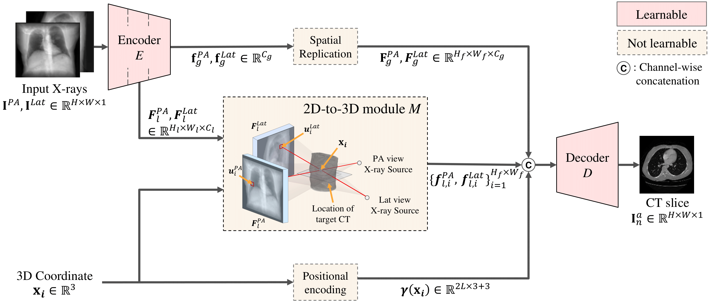

# Perspective Projection-Based 3D CT Reconstruction from Biplanar X-rays
<b> <a href="https://arxiv.org/abs/2303.05297"> Perspective Projection-Based 3D CT Reconstruction from Biplanar X-rays </a> </b> 
<br>
<a href="https://sites.google.com/view/daeunkyung/"> Daeun Kyung*</a>,
<a href="https://www.linkedin.com/in/kyungmin-jo-931264181/?originalSubdomain=kr/"> Kyungmin Jo*</a>,
<a href="https://sites.google.com/site/jaegulchoo/"> Jaegul Choo</a>,
<a href="http://www.joonseok.net/home.html"> Joonseok Lee</a>,
<a href="https://mp2893.com/"> Edward Choi</a>
<br>
<a href="https://2023.ieeeicassp.org/"> ICASSP 2023 (Best Student Paper Awards) </a>
<br> X-ray computed tomography (CT) is one of the most common imaging techniques used to diagnose various diseases in the medical field. Its high contrast sensitivity and spatial resolution allow the physician to observe details of body parts such as bones, soft tissue, blood vessels, etc. As it involves potentially harmful radiation exposure to patients and surgeons, however, reconstructing 3D CT volume from perpendicular 2D X-ray images is considered a promising alternative, thanks to its lower radiation risk and better accessibility. This is highly challenging though, since it requires reconstruction of 3D anatomical information from 2D images with limited views, where all the information is overlapped. In this paper, we propose PerX2CT, a novel CT reconstruction framework from X-ray that reflects the perspective projection scheme. Our proposed method provides a different combination of features for each coordinate which implicitly allows the model to obtain information about the 3D location. We reveal the potential to reconstruct the selected part of CT with high resolution by properly using the coordinate-wise local and global features. Our approach shows potential for use in clinical applications with low computational complexity and fast inference time, demonstrating superior performance than baselines in multiple evaluation metrics.
<br>
 


## Environment
### Setup
Clone the repository and navigate into the directory:
```
$ git clone https://github.com/dek924/PerX2CT.git
$ cd PerX2CT
```

### Install requirements
Create a conda environment, activate it, and install the required packages:
```
$ conda create -n perx2ct python=3.8
$ conda activate perx2ct
$ pip install --upgrade pip
$ pip install torch==1.8.1+cu111 torchvision==0.9.1+cu111 torchaudio==0.8.1 -f https://download.pytorch.org/whl/torch_stable.html
$ pip install -r requirement.txt
```

## Download
### Dataset
- We are currently utilizing the <a href="https://www.ncbi.nlm.nih.gov/pmc/articles/PMC3041807/">LIDC-IDRI</a> dataset. You can download the original dataset <a href="https://wiki.cancerimagingarchive.net/pages/viewpage.action?pageId=1966254">here</a>. 
Follow the instructions in [prepare_datasets.md](data_preprocessing/prepare_datasets.md) to preprocess the dataset.

### Pretrained Model
- We've provided the pretrained weights used for our paper's experiments. You can download these weights <a href="https://drive.google.com/drive/folders/14_V8E0XklPRax4S4nQfeUnHS2gml-_PO">here</a>.  <br /><br />

## Training
To train PerX2CT, run `main.py` with the hyper-parameters provided below:
```
python main.py --train True --gpus <gpu_ids> --name <exp_name> --base <path_to_base_config>
```
**Note**: The hyperparameters used in our paper's experiments are set as default. <br />
**Note**: The configuration for training the PerX2CT model without zoom-in is `configs/PerX2CT.yaml`, while the configuration for training the PerX2CT<sub>global</sub> model with zoom-in is `configs/PerX2CT_global_w_zoomin.yaml`. <br /><br />

## Evaluation
### Full frame evaluation (default)
To evaluate PerX2CT, use the following commands depending on the type of checkpoint (ckpt) you're working with:

- For evaluating your own experiments:
  ```
  python main_test.py --ckpt_name <checkpoint_name> --save_dir <experiment_dir> --val_test <target_test_set (val or test)>
  ```

- For evaluating our pre-trained checkpoints (or any other specific ckpt):
  ```
  python main_test.py --ckpt_path <checkpoint_path> --save_dir <save_dir> --config_path <config_path> --val_test <target_test_set (val or test)>
  ```
  **Note**: Using the configuration `configs/PerX2CT.yaml` for `PerX2CT.ckpt`, while the configuration for `PerX2CT_global.ckpt` is `configs/PerX2CT_global_w_zoomin.yaml`.


### Zoom-in frame evaluation (subgoal)
To evaluate PerX2CT for zoom-in task, using the following commands depending on the type of checkpoint (ckpt) you're working with:
- For evaluating your own experiments:
  ```
  python main_test_zoom.py --ckpt_name <checkpoint_name> --save_dir <checkpoint_dir> --zoom_size <target_zoomin_patch_size>
  ```

- For evaluating our pre-trained checkpoints (or any other specific ckpt):
  ```
  python main_test_zoom.py --ckpt_path <checkpoint_path> --save_dir <save_dir> --config_path <config_path> --zoom_size <target_zoomin_patch_size>
  ```
  **Note**: Use the same configuration as mentioned in the full frame evaluation section. <br /><br />


## Acknowledgements
This implementation uses code from following repositories:
- [Official X2CT-GAN implementation](https://github.com/kylekma/X2CT)
- [Official Taming Transformers implementation](https://github.com/CompVis/taming-transformers)

We thank the authors for their open-sourced code. <br /><br />


## Citation
```
@INPROCEEDINGS{10096296,
  author={Kyung, Daeun and Jo, Kyungmin and Choo, Jaegul and Lee, Joonseok and Choi, Edward},
  booktitle={ICASSP 2023 - 2023 IEEE International Conference on Acoustics, Speech and Signal Processing (ICASSP)}, 
  title={Perspective Projection-Based 3d CT Reconstruction from Biplanar X-Rays}, 
  year={2023},
  volume={},
  number={},
  pages={1-5},
  doi={10.1109/ICASSP49357.2023.10096296}}
```

## Contact
For any questions or concerns regarding this code, please contact to us ([kyungdaeun@kaist.ac.kr](mailto:kyungdaeun@kaist.ac.kr) or [bttkm@kaist.ac.kr](mailto:bttkm@kaist.ac.kr)).
